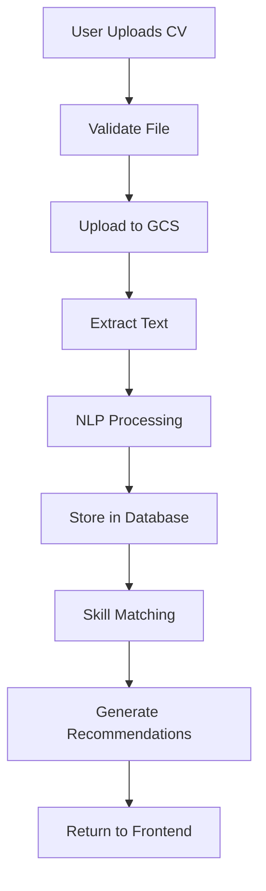

# AI Usage Documentation

This document outlines how AI tools (such as ChatGPT, Claude, GitHub Copilot, etc.) were used throughout the development of this project. It provides generic prompts and their outcomes in a tabular format, along with specific use cases.

## Table of Contents
1. [Generic Prompts and Responses](#generic-prompts-and-responses)
2. [Wireframe Generation](#wireframe-generation)
3. [Workflow Diagrams and Documentation](#workflow-diagrams-and-documentation)
4. [Firebase Setup and Deployment Guidance](#firebase-setup-and-deployment-guidance)
5. [Debugging and Troubleshooting](#debugging-and-troubleshooting)

---

## Generic Prompts and Responses

### Table: Common AI Prompts Used in Development

| Category | Prompt | AI Response/Outcome | Use Case |
|----------|--------|-------------------|----------|
| **API Documentation** | "Generate OpenAPI/Swagger documentation format for a REST API with authentication, CV upload, and job recommendations endpoints" | Provided complete API specification with request/response schemas, examples, and error codes | API documentation creation |
| **Error Handling** | "How to handle authentication errors in a React application with automatic token refresh and redirect to login?" | Provided implementation with axios interceptors, error boundaries, and token refresh logic | Authentication system implementation |
| **Testing** | "Write unit tests for a skill matching algorithm that uses Jaccard similarity to compare user skills with job requirements" | Generated test cases with edge cases, mock data, and assertions | Testing implementation |
| **Documentation** | "Write a comprehensive README for a React frontend project with setup instructions, architecture overview, and API integration guide" | Generated structured README with all necessary sections | Project documentation |

---

## Wireframe Generation

### Use Case: UI/UX Design

#### Prompts Used:

| Prompt | Output | Application |
|--------|--------|-------------|
| "Create a wireframe for a job recommendations page with filters (location, skills, job type), search bar, and job cards displaying match scores and required skills" | Complete wireframe with filter sidebar, search interface, and card layout | Opportunities page design |

#### Generated Wireframes:

- **Visualize UI layouts** before implementation
- **Communicate design ideas** to team members
- **Create consistent design patterns** across the application
- **Plan responsive breakpoints** for desktop

#### Example Wireframe Structure:

```
┌─────────────────────────────────────────┐
│  Header: Logo, Navigation, User Menu    │
├─────────────────────────────────────────┤
│                                         │
│  ┌──────────┐  ┌──────────┐          │
│  │  Profile │  │   Top    │          │
│  │  Summary │  │  Jobs    │          │
│  └──────────┘  └──────────┘          │
│                                         │
│  ┌──────────┐  ┌──────────┐          │
│  │   Skill  │  │  Market   │          │
│  │   Gaps   │  │ Insights  │          │
│  └──────────┘  └──────────┘          │
│                                         │
└─────────────────────────────────────────┘
```

---

## Workflow Diagrams and Documentation

### Use Case: Creating Visual Documentation

#### Prompts and Generated Diagrams:

| Prompt | Diagram Type | Output |
|--------|--------------|--------|
| "Create a data flow diagram showing how a CV upload goes through text extraction, NLP processing, skill matching, and job recommendation generation" | Data Flow Diagram | ASCII art diagram with step-by-step process flow |
| "Create a sequence diagram for the authentication flow showing user login, token generation, API request, and token refresh" | Sequence Diagram | Interaction flow between components |

#### Example Workflow Diagram Generated:



#### Markdown Documentation Generated:

AI helped create comprehensive markdown documentation including:
- **Setup guides** with step-by-step instructions
- **Architecture documentation** with diagrams
- **Deployment guides** with configuration examples
- **Troubleshooting guides** with common issues and solutions

---

## Firebase Setup and Deployment Guidance

### Use Case: Firebase Configuration and Deployment

#### Prompts Used for Firebase Setup:

| Prompt | AI Guidance Provided | Application |
|--------|---------------------|-------------|
| "How do I set up Firebase Hosting for a React application built with Vite, including build configuration and deployment steps?" | Complete Firebase setup guide with firebase.json configuration, build commands, and deployment workflow | Frontend deployment setup |
| "How to configure Firebase environment variables for different environments (dev, staging, production) in a React application?" | Environment variable setup with .env files and Firebase config | Environment configuration |
| "Provide troubleshooting steps for common Firebase deployment errors including build failures, authentication issues, and hosting configuration problems" | Comprehensive troubleshooting guide with solutions | Deployment debugging |

#### Firebase Setup Guide Generated:

1. **Firebase Project Initialization**
   ```bash
   # Install Firebase CLI
   npm install -g firebase-tools
   
   # Login to Firebase
   firebase login
   
   # Initialize Firebase in project
   firebase init hosting
   ```

2. **Firebase Configuration File** (`firebase.json`)
   ```json
   {
     "hosting": {
       "public": "dist",
       "ignore": [
         "firebase.json",
         "**/.*",
         "**/node_modules/**"
       ],
       "rewrites": [
         {
           "source": "**",
           "destination": "/index.html"
         }
       ]
     }
   }
   ```


| Issue | AI-Generated Solution |
|------|----------------------|
| **Environment variables** | Use Firebase Remote Config or build-time variables |
| **Authentication errors** | Verify Firebase SDK initialization and API keys |
| **Deployment permissions** | Check Firebase CLI authentication and project permissions |

---

## Debugging and Troubleshooting

### Use Case: Resolving Permission Issues and API Errors

#### Prompts for Service Account Issues:

| Problem | Prompt | AI Solution |
|---------|--------|-------------|
| **Permission denied when accessing Cloud Storage** | "I'm getting a 403 permission denied error when my Cloud Run service tries to access a Cloud Storage bucket. How do I fix the service account permissions?" | Provided IAM role assignment commands and service account configuration steps |
| **BigQuery access denied** | "My ingestion service can't write to BigQuery. What IAM roles does the service account need?" | Listed required roles (BigQuery Data Editor, Job User) and grant commands |
| **Secret Manager access errors** | "Cloud Build can't access secrets from Secret Manager. How do I grant the Cloud Build service account access to secrets?" | Provided secret accessor role assignment and secret IAM policy binding commands |

#### Service Account Debugging Solutions:

**1. Cloud Storage Access**
```bash
# Grant Storage Object Admin role
gcloud projects add-iam-policy-binding PROJECT_ID \
  --member="serviceAccount:SERVICE_ACCOUNT@PROJECT_ID.iam.gserviceaccount.com" \
  --role="roles/storage.objectAdmin"
```

**2. BigQuery Access**
```bash
# Grant BigQuery Data Editor and Job User roles
gcloud projects add-iam-policy-binding PROJECT_ID \
  --member="serviceAccount:SERVICE_ACCOUNT@PROJECT_ID.iam.gserviceaccount.com" \
  --role="roles/bigquery.dataEditor"

gcloud projects add-iam-policy-binding PROJECT_ID \
  --member="serviceAccount:SERVICE_ACCOUNT@PROJECT_ID.iam.gserviceaccount.com" \
  --role="roles/bigquery.jobUser"
```

**3. Secret Manager Access**
```bash
# Grant Secret Manager Secret Accessor role
gcloud secrets add-iam-policy-binding SECRET_NAME \
  --member="serviceAccount:SERVICE_ACCOUNT@PROJECT_ID.iam.gserviceaccount.com" \
  --role="roles/secretmanager.secretAccessor"
```

#### Prompts for API Errors:

| Problem | Prompt | AI Solution |
|---------|--------|-------------|
| **JSearch API authentication failed** | "I'm getting a 401 unauthorized error when calling the JSearch API. How do I verify my API key is correctly configured in Secret Manager?" | Provided secret verification commands and API key validation steps |
| **CORS errors in frontend** | "My React app is getting CORS errors when calling the backend API. How do I configure CORS in FastAPI?" | Provided CORS middleware configuration with allowed origins |
| **Rate limiting issues** | "I'm hitting rate limits on external APIs. How can I implement request throttling and caching?" | Suggested Redis caching and rate limiting strategies |

#### API Error Debugging Solutions:

**1. API Key Verification**
```bash
# Check secret value
gcloud secrets versions access latest --secret="JSEARCH_API_KEY"

# Test API key
curl -H "X-RapidAPI-Key: YOUR_KEY" \
     -H "X-RapidAPI-Host: jsearch.p.rapidapi.com" \
     https://jsearch.p.rapidapi.com/search
```

**2. CORS Configuration (FastAPI)**
```python
from fastapi.middleware.cors import CORSMiddleware

app.add_middleware(
    CORSMiddleware,
    allow_origins=["http://localhost:5174", "https://yourdomain.com"],
    allow_credentials=True,
    allow_methods=["*"],
    allow_headers=["*"],
)
```

#### Common Debugging Workflows Generated:

1. **Service Account Permission Debugging**
    - List current IAM bindings
    - Verify service account assignment
    - Test permissions with gcloud commands
    - Grant missing roles

2. **API Error Troubleshooting**
    - Check API key configuration
    - Verify request headers
    - Test endpoints with curl
    - Review Cloud Logging for detailed errors

3. **Deployment Issue Resolution**
    - Check Cloud Build logs
    - Verify environment variables
    - Test Docker image locally
    - Review Cloud Run service logs

---

### Tools Used:

- **ChatGPT**: Primary AI assistant for debugging, documentation and workflow diagrams and generating markdown documentation for setup guides


